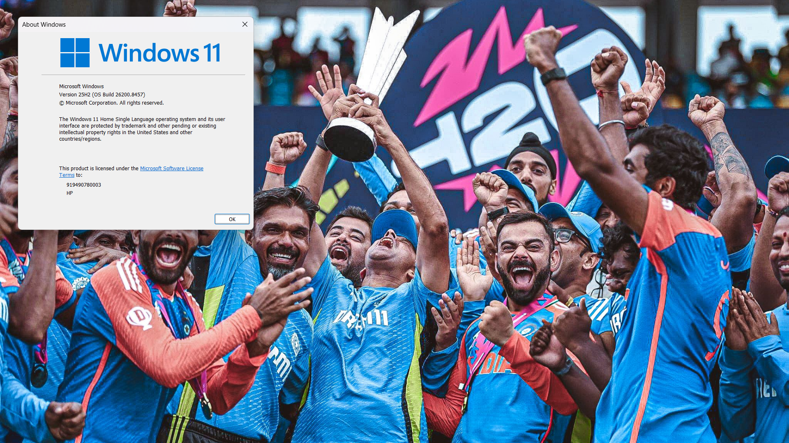
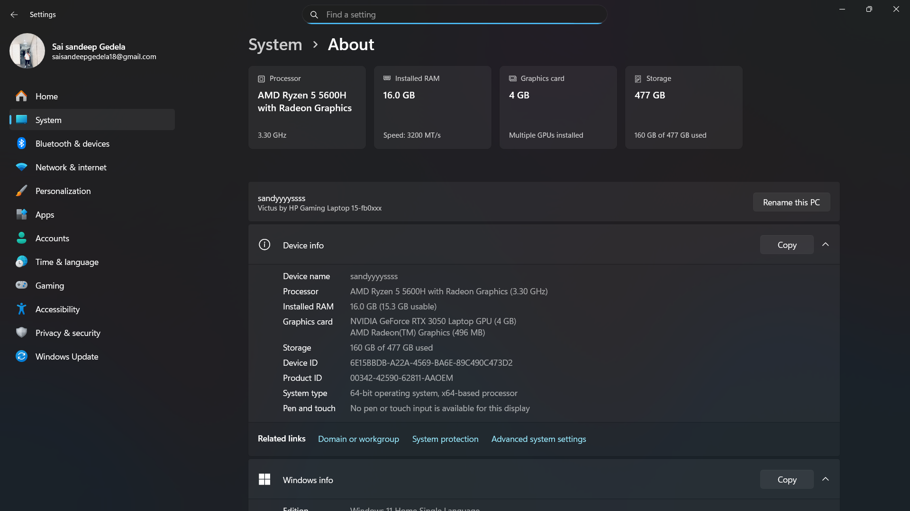
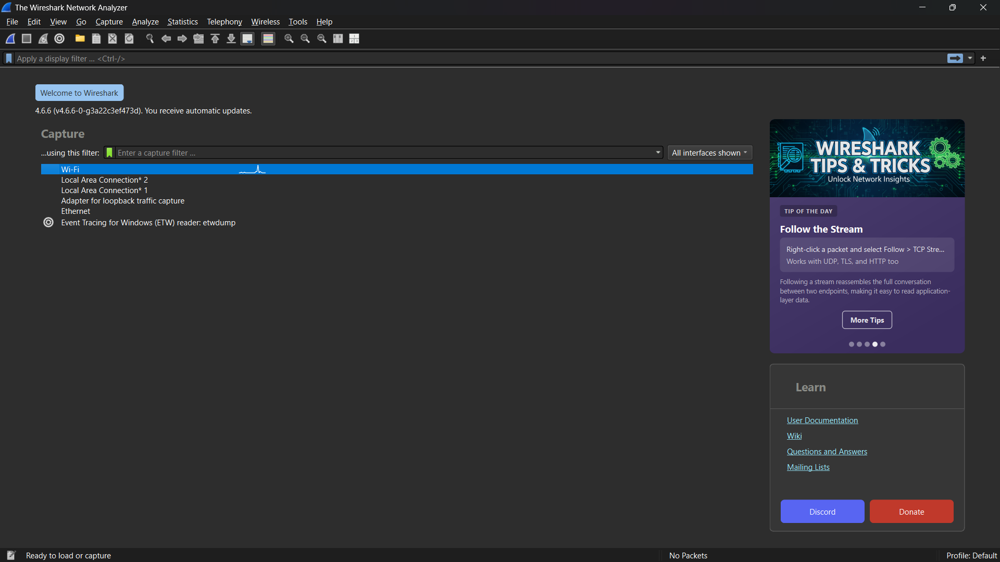
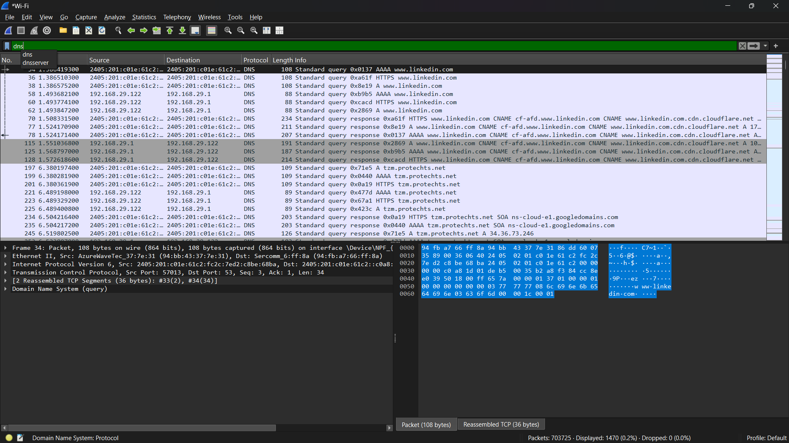
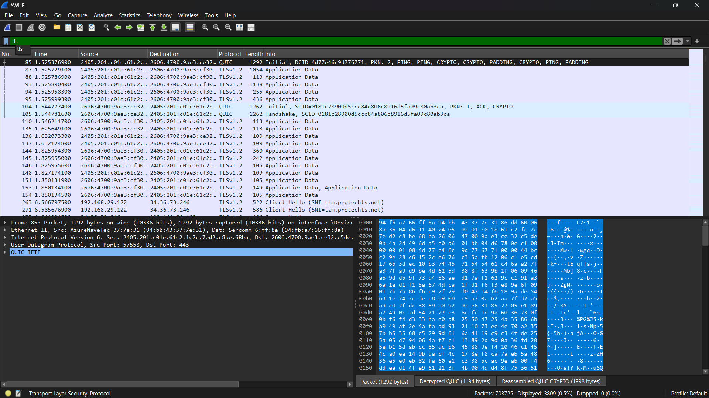
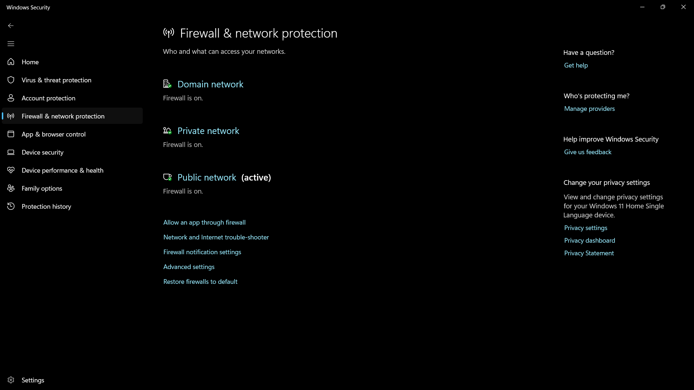
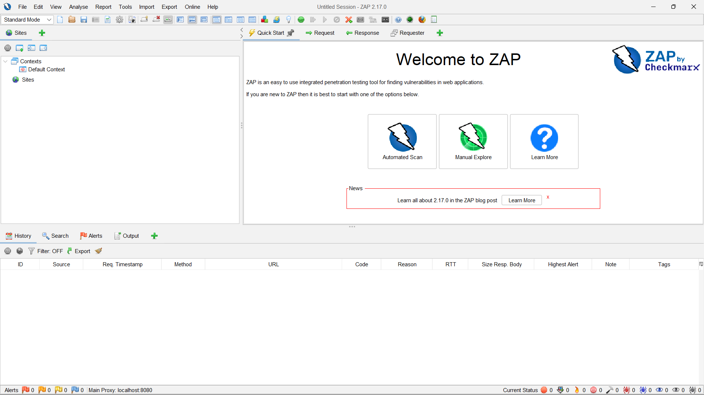
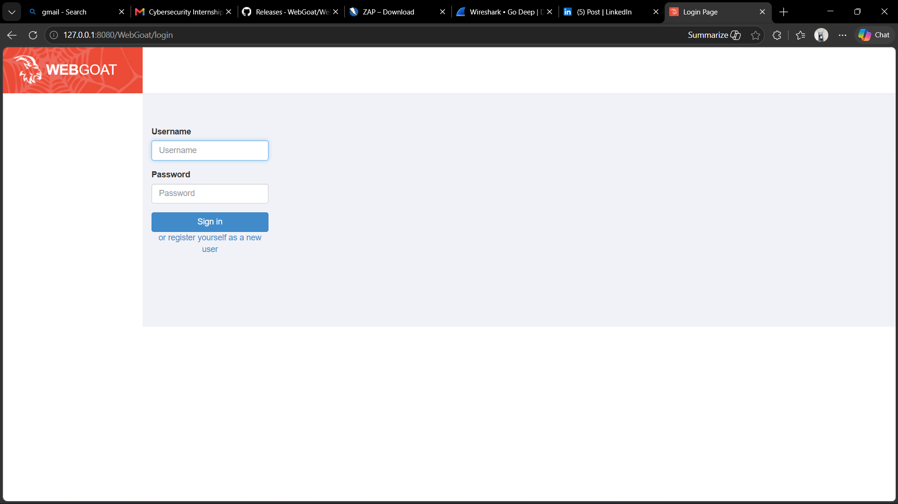
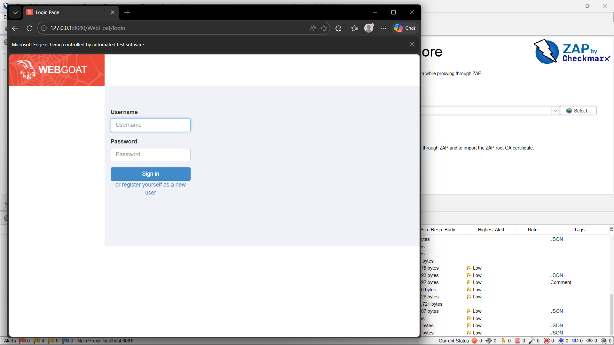
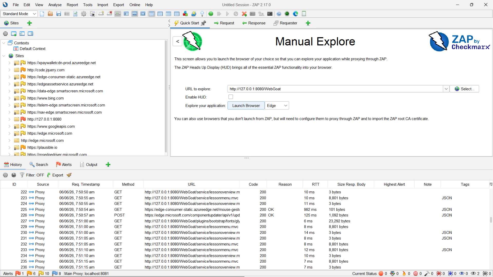

<p align="center">

</p>

<h1 align="center">🔐 Redynox Cyber Security Internship 2026</h1>

<p align="center">
Hands-on Cyber Security Internship focusing on <b>Network Security</b>, <b>Traffic Analysis</b>, and <b>Web Application Security Testing</b>.
</p>

<p align="center">


</p>

---

# 👨‍💻 Author

**Sai Sandeep Gedela**

🎓 B.Tech – Computer Science & Engineering

🔐 Cyber Security Enthusiast

☁️ Cloud Computing

🤖 Artificial Intelligence

---

# 📖 About This Repository

This repository contains all the practical work completed during the **Redynox Cyber Security Internship**.

The internship provided hands-on experience with:

- Network Traffic Monitoring
- Packet Analysis
- DNS Investigation
- TLS Inspection
- Windows Firewall Configuration
- Web Application Security Testing
- Vulnerability Assessment
- OWASP Security Concepts

---

# 🎯 Internship Objectives

- Understand Network Security
- Learn Packet Capture
- Study DNS Resolution
- Analyze TLS Encryption
- Configure Windows Firewall
- Perform Web Application Security Testing
- Learn Secure Development Practices

---

# 📊 Internship Progress

| Task | Status |
|------|--------|
| Windows Firewall Configuration | ✅ Completed |
| Wireshark Installation | ✅ Completed |
| DNS Packet Analysis | ✅ Completed |
| TLS Packet Analysis | ✅ Completed |
| OWASP ZAP Installation | ✅ Completed |
| WebGoat Installation | ✅ Completed |
| Web Application Security Testing | ✅ Completed |
| Final Internship Report | ✅ Completed |

---

# 🛠️ Tools Used

| Tool | Purpose |
|------|---------|
| Wireshark | Packet Capture & Analysis |
| Windows Defender Firewall | Host Firewall |
| OWASP ZAP | Web Security Testing |
| WebGoat | Vulnerable Web Application |
| Microsoft Edge | Browser Testing |
| Windows 11 | Operating System |
| Java Runtime | WebGoat Execution |

---

# 💻 System Specifications

| Component | Details |
|-----------|---------|
| Processor | AMD Ryzen 5 5600H |
| RAM | 16 GB |
| GPU | NVIDIA RTX 3050 Laptop GPU |
| Operating System | Windows 11 Home Single Language |
| Browser | Microsoft Edge |

---

# 📂 Repository Structure

```text
Redynox-CyberSecurity-Internship-2026
│
├── 📁 Report
│   └── Redynox Cybersecurity Internship FINAL Report.pdf
│
├── 📁 Screenshots
│   ├── Screenshot (1).png
│   ├── Screenshot (2).png
│   ├── Screenshot (3).png
│   ├── Screenshot (4).png
│   ├── Screenshot (5).png
│   ├── Screenshot (6).png
│   ├── Screenshot (7).png
│   ├── Screenshot (8).png
│   ├── Screenshot (9).png
│   └── Screenshot (10).png
│
├── 📁 Documentation
│
├── 📁 Assets
│
├── 📄 README.md
│
└── 📄 LICENSE
```

---

# 🔬 Practical Activities

## Task 1 – Network Security

✔ Windows Defender Firewall Verification

✔ Wireshark Installation

✔ Network Interface Selection

✔ DNS Packet Capture

✔ TLS Traffic Analysis

✔ Packet Inspection

---

## Task 2 – Web Application Security

✔ OWASP ZAP Installation

✔ WebGoat Installation

✔ Proxy Configuration

✔ Manual Explore

✔ Request Interception

✔ Response Analysis

✔ Web Security Testing

---

# 🛡️ Cyber Security Workflow

```text
                 Internet
                     │
                     ▼
          Windows Defender Firewall
                     │
                     ▼
               Microsoft Edge
                     │
                     ▼
              OWASP ZAP Proxy
                     │
                     ▼
                 WebGoat
                     │
                     ▼
         HTTP Request / Response
                     │
                     ▼
              Security Analysis
```

---

# 📡 Network Packet Analysis Workflow

```text
Network Traffic
       │
       ▼
Wi-Fi Adapter
       │
       ▼
Wireshark Capture
       │
       ▼
DNS Analysis
       │
       ▼
TLS Inspection
       │
       ▼
Traffic Investigation
```

---

# 📸 Project Screenshots

## 🖥️ Windows Version

<p align="center">

</p>

---

## 💻 System Information

<p align="center">

</p>

---

## 🦈 Wireshark Installation

<p align="center">

</p>

---

## 🌐 DNS Packet Analysis

<p align="center">

</p>

---

## 🔒 TLS Packet Analysis

<p align="center">

</p>

---

## 🛡️ Windows Defender Firewall

<p align="center">

</p>

---

## 🔴 OWASP ZAP Dashboard

<p align="center">

</p>

---

## 🐐 WebGoat Login

<p align="center">

</p>

---

## 🏠 WebGoat Dashboard

<p align="center">

</p>

---

## 🔍 ZAP Manual Explore

<p align="center">

</p>